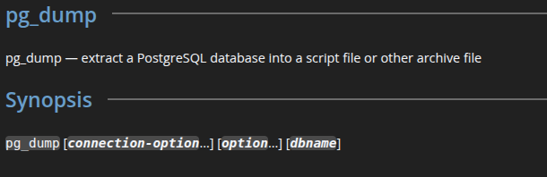
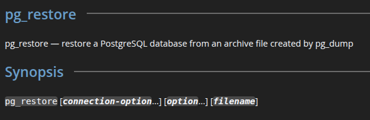
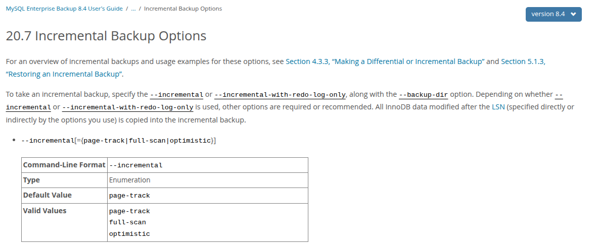

# Домашнее задание к занятию "`Резервное копирование баз данных`" - `Рахманов Александр`


### Инструкция по выполнению домашнего задания

   1. Сделайте `fork` данного репозитория к себе в Github и переименуйте его по названию или номеру занятия, например, https://github.com/имя-вашего-репозитория/git-hw или  https://github.com/имя-вашего-репозитория/7-1-ansible-hw).
   2. Выполните клонирование данного репозитория к себе на ПК с помощью команды `git clone`.
   3. Выполните домашнее задание и заполните у себя локально этот файл README.md:
      - впишите вверху название занятия и вашу фамилию и имя
      - в каждом задании добавьте решение в требуемом виде (текст/код/скриншоты/ссылка)
      - для корректного добавления скриншотов воспользуйтесь [инструкцией "Как вставить скриншот в шаблон с решением](https://github.com/netology-code/sys-pattern-homework/blob/main/screen-instruction.md)
      - при оформлении используйте возможности языка разметки md (коротко об этом можно посмотреть в [инструкции  по MarkDown](https://github.com/netology-code/sys-pattern-homework/blob/main/md-instruction.md))
   4. После завершения работы над домашним заданием сделайте коммит (`git commit -m "comment"`) и отправьте его на Github (`git push origin`);
   5. Для проверки домашнего задания преподавателем в личном кабинете прикрепите и отправьте ссылку на решение в виде md-файла в вашем Github.
   6. Любые вопросы по выполнению заданий спрашивайте в чате учебной группы и/или в разделе “Вопросы по заданию” в личном кабинете.
   
Желаем успехов в выполнении домашнего задания!
   
### Дополнительные материалы, которые могут быть полезны для выполнения задания

1. [Руководство по оформлению Markdown файлов](https://gist.github.com/Jekins/2bf2d0638163f1294637#Code)

---

## Решение.

### Задание 1. Резервное копирование.

#### Кейс.

Финансовая компания решила увеличить надёжность работы баз данных и их резервного копирования.
Необходимо описать, какие варианты резервного копирования подходят в случаях:

**1.** Необходимо восстанавливать данные в полном объёме за предыдущий день.  
**2.** Необходимо восстанавливать данные за час до предполагаемой поломки.

*Приведите ответ в свободной форме.*


**1.** Оптимальное решение для восстановления данных в полном объёме за предыдущий день - это полное резервное копирование (Full backup), которое выполняется ежедневно (например, в полночь). Это обеспечит полное дублирование всей базы данных, простоту восстановления (не требуется дополнительных инкрементных или дифференциальных копий) и надежность хранения (одна копия содержит все данные).  
**Инструменты:**  
`PostgreSQL` - pg_dump, pg_basebackup, Databasus, Ottamatik.  
`MySQL` - mysqldump, Percona XtraBackup, SQLBackupAndFTP, Vembu BDR Suite.  
`SQL Server` - SSMS, T-SQL (с использованием инструкции BACKUP DATABASE).

**2.** Для восстановления данных с точностью до часа необходимо использовать полный бэкап + WAL-логи (или журналы транзакций) для Point-in-Time Recovery (PITR). Так как WAL-логи позволяют восстановить базу до точного момента (например, за час до сбоя).  
**Инструменты:**  
`PostgreSQL` - pg_basebackup + archive_mode.  
`MySQL` - Percona XtraBackup + binary logs.  
`SQL Server` - BACKUP LOG

---

### Задание 2. PostgreSQL.

**1.** С помощью официальной документации приведите пример команды резервирования данных и восстановления БД (pgdump/pgrestore).

*Приведите ответ в свободной форме.*

**pg_dump** — Резервное копирование (экспортировать базу данных PostgreSQL в виде SQL-скрипта или в других форматах).



```
pg_dump -U username -d dbname -Fc -f dump_file.dump
```
где:  
`-U` - имя пользователя;  
`-d` - название базы данных;  
`-Fc` - формат сжатия;  
`-f` - имя файла дампа.

**pg_restore** - Восстановление данных из дампа.



```
pg_restore -U username -d dbname --create --verbose backup_file.dump
```
где:  
`-U` - имя пользователя;  
`-d` - название базы данных;  
`--create` - указывает утилите создать базу данных перед восстановлением данных;  
`--verbose` - включает подробный режим вывода.

---

### Задание 3. MySQL.

**1.** С помощью официальной документации приведите пример команды инкрементного резервного копирования базы данных MySQL.

*Приведите ответ в свободной форме.*

Инкрементное резервное копирование в MySQL обычно выполняется с использованием утилиты mysqlbackup из MySQL Enterprise Backup (которая является платной) или с помощью бинарных логов (log_bin) в стандартной версии MySQL.

Использование mysqlbackup:



```
mysqlbackup --incremental=optimistic --incremental-base=history:last_backup --backup-dir=/path/to/backup --backup-image=incremental_image.bi backup-to-image
```
`--incremental=optimistic` - режим оптимистичного инкрементного бэкапа  
`--incremental-base=history:last_backup` - использование последнего полного бэкапа как базы  
`--backup-dir` - директория для хранения бэкапа  
`--backup-image` - имя файла для сохранения инкрементного бэкапа

Чтобы настроить `log_bin` для инкрементного копирования в стандартной версии MySQL, нужно включить двоичное ведение журнала. Для этого необходимо отредактировать файл конфигурации MySQL по умолчанию.

---
